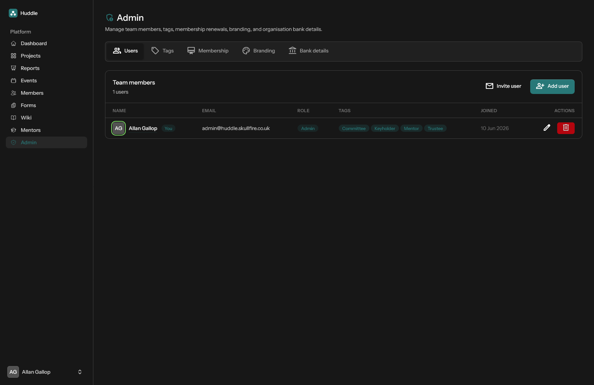

# Admin

Central management for organisation configuration. Available to users with the **admin** role only.

[← Back to features](README.md)

## Users

- Invite users by email (sends a password-reset link)
- Add users directly with role assignment
- Edit names, emails, roles, and tags
- Remove users (the last admin cannot be deleted)

## Tags

- Create and edit user flags (Mentor, Committee, Keyholder, etc.)
- Assign tags to users from the user edit modal

Tags control access across the platform — see [Roles and permissions](roles-and-permissions.md).

## Membership

- **Periods** — define membership renewal windows (name, start date, end date)
- **Assignments** — assign members to renewal periods; used for active/expired filtering on the [Members](members.md) page

## Branding

Customise the organisation's appearance:

- Logo, favicon, and light/dark banner images
- Uploads replace the default Huddle branding across the application
- Defaults are generated from the organisation name when no custom assets are set

## Bank details

Store organisation payment information used on [project](projects.md) quotes and invoices:

- Account name, bank name, sort code, account number, IBAN
- Free-text payment instructions
