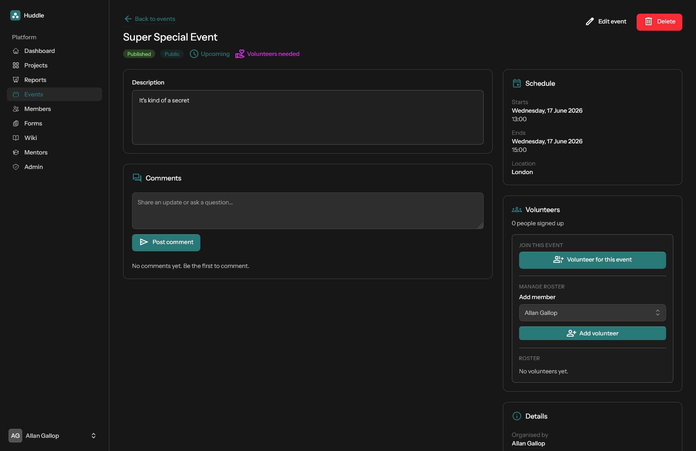

# Events

Plan and publish community events with scheduling, visibility, and volunteer coordination.

[← Back to features](README.md)

## Event list

View upcoming and past events with status, type, and volunteer badges. Filter and create new events from the index page.

## Event detail

- Description and threaded comments
- Schedule (start/end times) and location
- Public or private visibility — private events are visible only to organisers, volunteers, and admins
- Volunteer sign-up and admin roster management
- Status badges: published, public/private, upcoming/ongoing, volunteers needed

## Statuses

`draft` · `published` · `cancelled` · `archived`

## Event types

`public` · `private`

## Permissions

See [Roles and permissions](roles-and-permissions.md#project-and-event-ownership).
