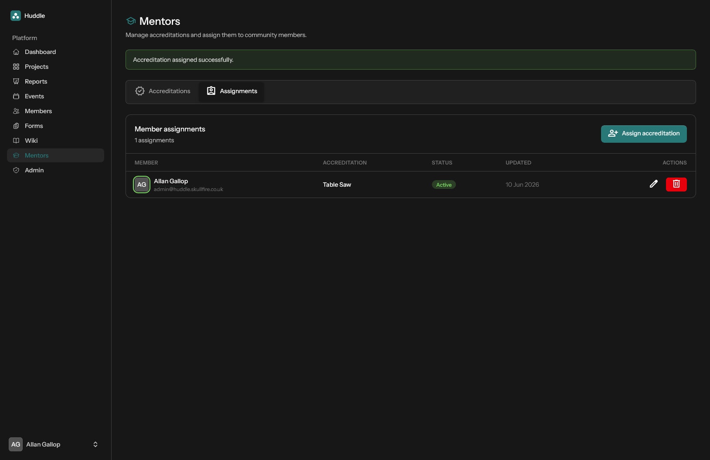

# Mentors

Manage skills accreditations and assign them to members.

[← Back to features](README.md)

## Accreditations tab

Define accreditation types (e.g. "Table Saw", "First Aid") with name, description, and active/inactive status.

## Assignments tab

- Assign accreditations to members
- Track active/inactive status per assignment
- Edit or remove assignments

Assigned accreditations appear on each member's profile in the [Members](members.md) directory.

## Permissions

The Mentors area is available to users with the **Mentor** tag and to admins. See [Roles and permissions](roles-and-permissions.md).
