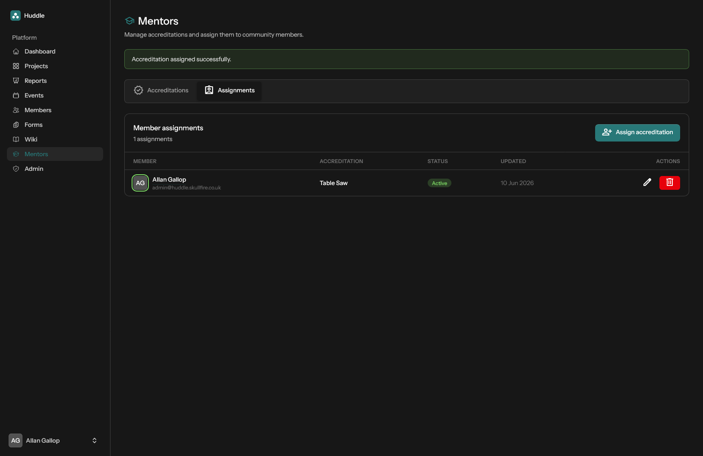

# Mentors (manage accreditations)

Create accreditation types, assign them to members, and (for admins) nominate who members should ask for guidance.

[← Back to features](README.md)

Route: `/mentors` (sidebar: **Manage accreditations**)

## Accreditations tab

Define accreditation types (e.g. "Table Saw", "First Aid") with name, description, and active/inactive status.

## Assignments tab

- Assign accreditations to members (searchable member picker)
- Track active/inactive status per assignment
- Edit or remove assignments

Assigned accreditations appear on each member's profile and on the public [Accreditations](accreditations.md) directory.

## Mentors tab (admins only)

For each accreditation, choose members who act as contacts (“who to ask”). Those names appear on the public [Accreditations](accreditations.md) page.

## Exams

Users with the **Assign exam to accreditation** permission can link a published exam to an accreditation. Members who **pass** that exam are automatically assigned the accreditation. See [Forms](forms.md#exams-and-accreditations).

## Permissions

Requires the **admin** role or the **Assign exam to accreditation** permission (included on the seeded Mentor role). See [Roles and permissions](roles-and-permissions.md).
