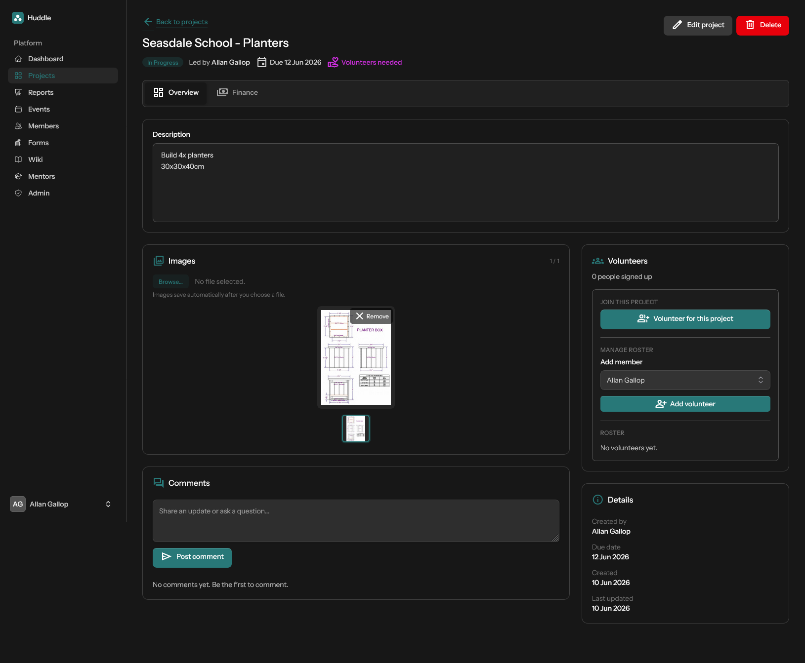

# Projects

Track community build and improvement work from idea through completion.

[← Back to features](README.md)

## Project list

Browse all projects with status badges, leader, due dates, and volunteer indicators. Members can create new projects; non-admins are automatically assigned as project leader when they do.

## Project detail

Each project page has two tabs for users with financial access.

### Overview

- Description
- Image gallery with upload, thumbnail navigation, aspect-ratio previews, and a full-size modal on click
- Threaded comments and replies
- Volunteer sign-up, roster management (for admins), and project metadata

### Finance

Available to the project leader or an admin.

- Quote and invoice amounts with notes
- Deposit and payment tracking
- Financial status workflow: quoted → invoiced → deposit paid → paid
- Generate PDF quotes and invoices
- Email documents directly from the project page

Bank details from [Admin → Bank details](admin.md#bank-details) appear on generated documents.

## Statuses

`draft` · `outstanding` · `in-progress` · `completed` · `cancelled` · `archived`

## Permissions

See [Roles and permissions](roles-and-permissions.md#project-and-event-ownership).
