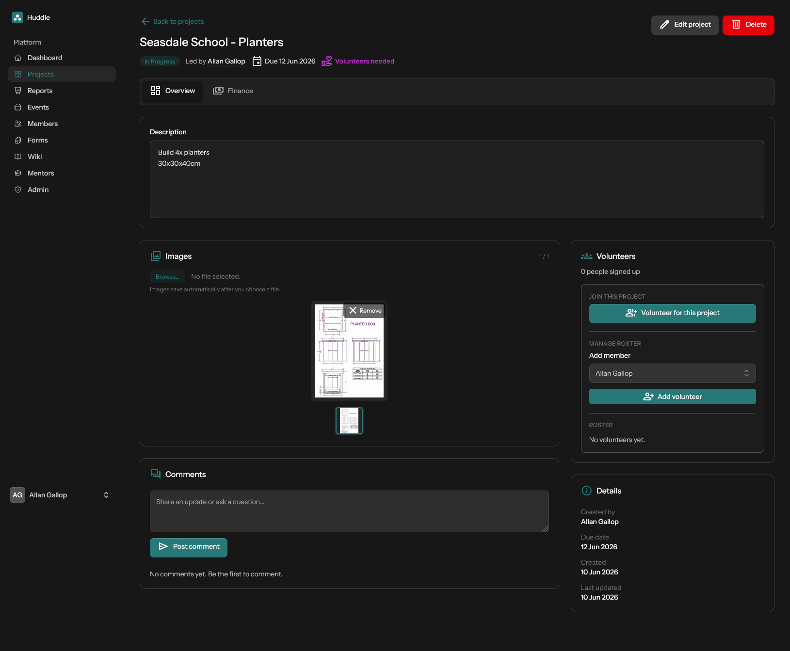

# Projects

Track community build and improvement work from idea through completion.

[← Back to features](README.md)

## Project list

Browse projects in a compact table: name and category badges on one line, coloured activity counts (comments, volunteers, images) underneath, plus columns for leader, status, **volunteers wanted**, due date, finance (when permitted), and dates. Status is highlighted with a coloured accent on each row.

Members can create new projects; non-admins are automatically assigned as project leader when they do. Leader and other member fields use a searchable select.

Filter by status, leader, category, volunteers, and (for leaders/admins) financial status.

## Categories

Projects can have one or more categories (e.g. Woodshop, H&S, Metalwork). Admins manage the category list under [Admin → Categories](admin.md). Categories are assigned when creating or editing a project.

## Project detail

Each project page has two tabs for users with financial access.

### Overview

- Description
- Image gallery with upload, thumbnail navigation, aspect-ratio previews, and a full-size modal on click
- Threaded comments and replies
- Volunteer sign-up, roster management (for admins; searchable member picker), and project metadata

### Finance

Available to the project leader or an admin.

- Quote and invoice amounts with notes
- Deposit and payment tracking
- Financial status workflow: quoted → invoiced → deposit paid → paid
- Generate PDF quotes and invoices
- Email documents directly from the project page

Bank details from [Admin → Bank details](admin.md#bank-details) appear on generated documents.

## Statuses

`draft` · `outstanding` · `in-progress` · `completed` · `cancelled` · `archived`

## Permissions

Creators manage their own projects. **Edit any project** / **Delete any project** extend that to others’ work. Admins can manage volunteers and assign leaders. See [Roles and permissions](roles-and-permissions.md#project-and-event-ownership).
